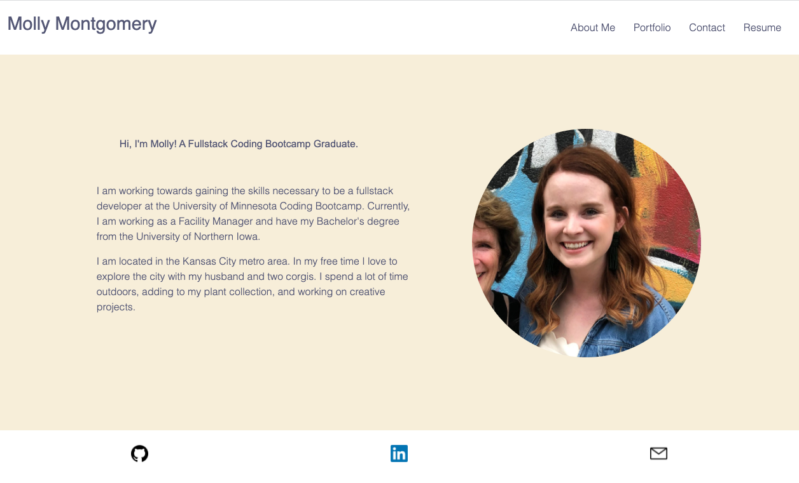

# React Portfolio

  ## Description
  This is my React professional portfolio. You will be able to read about me, my portfolio, contact me form and see my resume. 
  Deployed app: https://mollymontgomery.github.io/Molly_Montgomery_React_Portfolio/

  ## Table of Contents
  
  *[Installation](#installation) 
  *[Usage](#usage) 
  *[Demo](#demo) 
  *[Credits](#credits) 
  *[Questions](#questions)

  ## Installation
  1. Install dependencies required. And initialize node and run npm install.
  
  ## Usage
  Clone the repo, navigate to the root folder and fun the following commands

  1. npm install
  2. npm start 

  ## Demo
  #### Main Page
 

  ## Credits
  Stack Overflow   
  Brian Gearty - My tutor

  ## Questions
  If you have any questions regarding the repo please contact mollymontgomery515@gmail.com and see my other work on my github at [mollymontgomery](https://www.github.com/mollymontgomery) 
